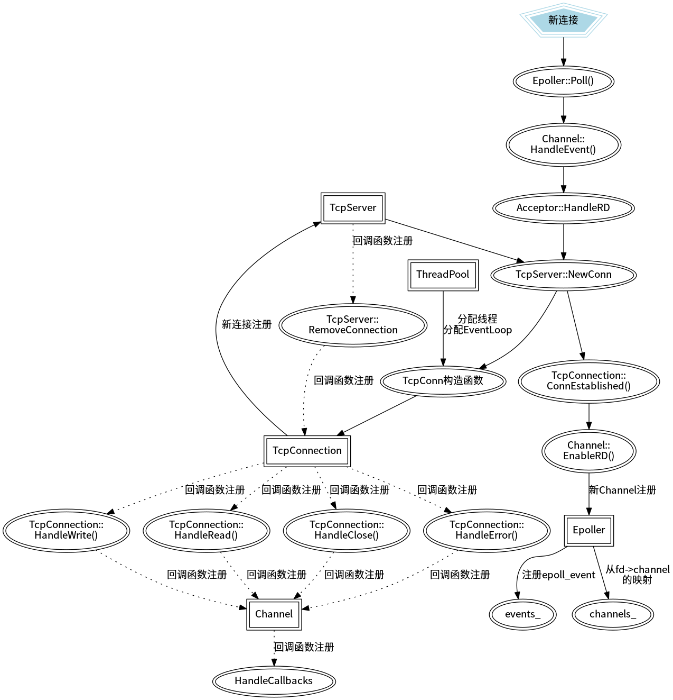

# bbkgl: A High Performance C++ Network Library

 

> 之前自己写过一个网络库，在看了陈硕大佬的书后觉得写的实在太差了，所以仿照muduo库重新写了一个。为什么叫bbkgl，因为是“宝宝可乖了”的首字母组成的。后来觉得网络库叫这个名字不太合适，但是懒得改了。。。

## Introduction

bbkgl是一个仿照muduo(木铎)网络库实现的基于Reactor模式以及非阻塞IO的现代C++多线程网络库，整体的思路大体与muduo相同。

## Technical points

- 使用epoll水平触发的IO多路复用技术，非阻塞IO，基于Reactor模式
- 实现了基于二叉搜索树(STL set)的定时器管理队列
- 使用了Linux中的eventfd实现了线程的异步唤醒
- 使用多线程处理连接，充分利用多核处理器的性能
- 主线程只负责接受连接请求，使用Round robin的方式分发给其他IO线程处理
- 使用智能指针等RAII机制减少内存泄漏的可能
- 支持shutdown优雅关闭连接
- 禁用Nagle算法，降低延迟

- 实现了Buffer类，可以既方便又高效率地收发数据

## Environment

- OS: Ubuntu 16.04 LTS
- Complier: g++  5.4.0
- Build: CMake
- IDE: CLion
- Editor: vim + vscode

## Model

并发模型为Reactor+非阻塞IO+线程池，新连接使用Round robin分配给IO线程。

## How to work

> 接下来介绍一下以网络库为基础实现的一个简单echo服务器如何接受连接、收发消息，以及断开连接的流程。

注，在以下的流程图中：
- 五边形表示其他信号接入
- 椭圆表示函数/成员函数
- 矩形框表示类或者对象，这里类和对象没有作明显的区分，流程图主要用于帮助理解，所以没必要
- 实线
  - 指向函数表示函数调用以及注册（指事件channel注册和连接TcpConnection注册，该动作会进行标明）
  - 指向类/对象表示从属关系
- 虚线：回调函数的注册过程

### 1. 服务器TcpServer启动

上述过程是整个TcpServer启动，且未接受新连接的时候，进行的初始化动作。

主要做了以下三件事：

1. 申请到套接字文件描述符，开始启动了监听（封装了socket()->bzero()->bind()->listen()等函数过程）；
2. 将接收新连接的回调函数注册到了accept_channel中，主要是对accept()函数的封装：
   - 通过std::bind()和std::function<>()实现，类似于函数指针；
   - 最后注册在了accept_channel对象的read_callback_成员中。
3. 将accept_channel注册到Epoller中：
   - 在Epoller::events_中注册，其实就是struct epoll_event 数组中注册；
   - 在channels_中注册，用std::map映射实现。

### 2. 接受新连接

流程图演示了接受新连接的整个过程，主要是完成以下几件事：

1. Epoller::Poll()检测到新的可读事件，根据之前注册的回调函数，接受连接请求，调用TcpServer::NewConn()建立新的连接；
2. 给把的连接分配给子线程处理，其中包括了已经在子线程工作的EventLoop对象；
3. 新连接TcpConnection对象的成员channel_注册到Epoller中；
4. 新连接TcpConnection对象注册到TcpServer中，同时TcpServer会把自身移除连接的函数以及用户设置的函数注册到TcpConnection中。

### 3. 收发消息

收发消息就比较简单了，主要是Buffer类的使用，流程图中说的比较清楚了。

这里要说的一点是，回复消息这件事是由用户来注册函数完成的，也就是说用户需要注册一个函数到TcpConnection对象中，该函数需要调用TcpConnection::Send()函数，TcpConnection对象中会调用用户调用的回调函数完成消息的收发。而回调函数注册的过程已经在“2.接收新连接”中介绍了，也就是用户只要把函数注册进TcpServer对象中就行了。

### 4. 断开连接

example中的echo服务器并没有实现主动断开连接的过程，这里主要讲的是客户端断开连接，服务端要做的事情。感觉是比较复杂的，同时坑也很多。。。

1. Epoller::Poll()检测到事件，然后在EVentLoop::Loop()调用了Channel::HandleEvent()进行处理，判断是读事件，同时收到的长度为0，说明客户端主动断开连接；
2. 断开连接要做的第一件事是在Epoll::events_中取消注册的事件，这个很简单也很好理解；
3. 第二件事是在TcpServer::connections_中删除新连接建立时的映射；
4. 第三件事是要在``Epoller::channels_`中删除新连接建立时其成员`TcpConnection::channel_`的映射；

陈硕大佬在书中说到了，断开连接比接受连接要复杂困难得多，主要指的就是对象生命期的管理。

上述第二件事和第三件事在完成过程中联系很大，TcpConnection对象在TcpServer中删除映射后，就失去了指向本对象的一个智能指针，这时候引用计数只剩下1，也就是在TcpServer::RemoveConnection()函数中的一个临时智能指针还在指向TcpConnection对象，当TcpServer::RemoveConnection()执行完以后，TcpConnection对象的引用计数为0，会调用其析构函数，同时会先调用其成员`TcpConnection::channel_`的析构函数，这也就导致了之前的Channel::HandleEvent()函数还没执行完，其所在的对象就被析构了，这个问题困扰了我很久。

最后的解决办法是：将TcpServer::RemoveConnection()函数中临时智能指针和TcpConnection::ConnDestroyed()函数绑定到EventLoop::QueueInLoop()中执行，这样就会一直有一个智能指针指向TcpConnection对象，最后会先把Channel::HandleEvent()函数执行完，再执行TcpConnection::ConnDestroyed()函数，避免了对象被提前析构的问题。

## More

截至2019.04.06, 历时整整31天，网络库的编写基本完成。

网络库还有很多要完善的地方：

- 未实现异步日志；
- 未实现http服务器；
- 没有尝试边沿触发；
- 部分类中仍然使用的是普通指针；
- 没有进行压测；
- …

## Contact

Email: zoujk@cumt.edu.cn